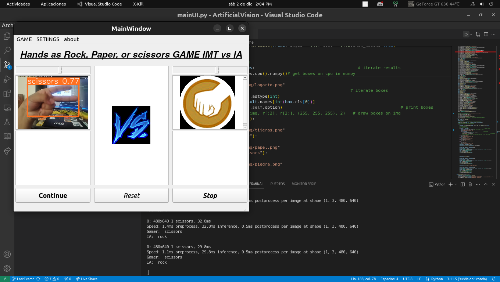

# ArtificialVision EXAMEN = RAMA "LastExam"
Funciona:



Este repositorio contiene el código necesario para ejecutar y evaluar el Examen Final de Visión Artificial. Sigue los pasos a continuación para instalar y ejecutar el modelo.

## Requisitos Previos
- [Conda](https://docs.conda.io/projects/conda/en/latest/user-guide/install/index.html) debe estar instalado en tu sistema.

## Instrucciones de Instalación

```bash
git clone https://github.com/97hackbrian/ArtificialVision.git
cd ArtificialVision
git switch LastExam

conda env create -f environment.yml
conda activate exVision
```
o 

```bash
    pip install -r requirements.txt
```

## Ejecución del juego/examen

```bash
    python3 scr/mainUI.py

```

## Resultados del modelo
Para poder ver los resultados del modelo puede verlos en el notebook 
```bash
 /scr/main.ipynb
```
