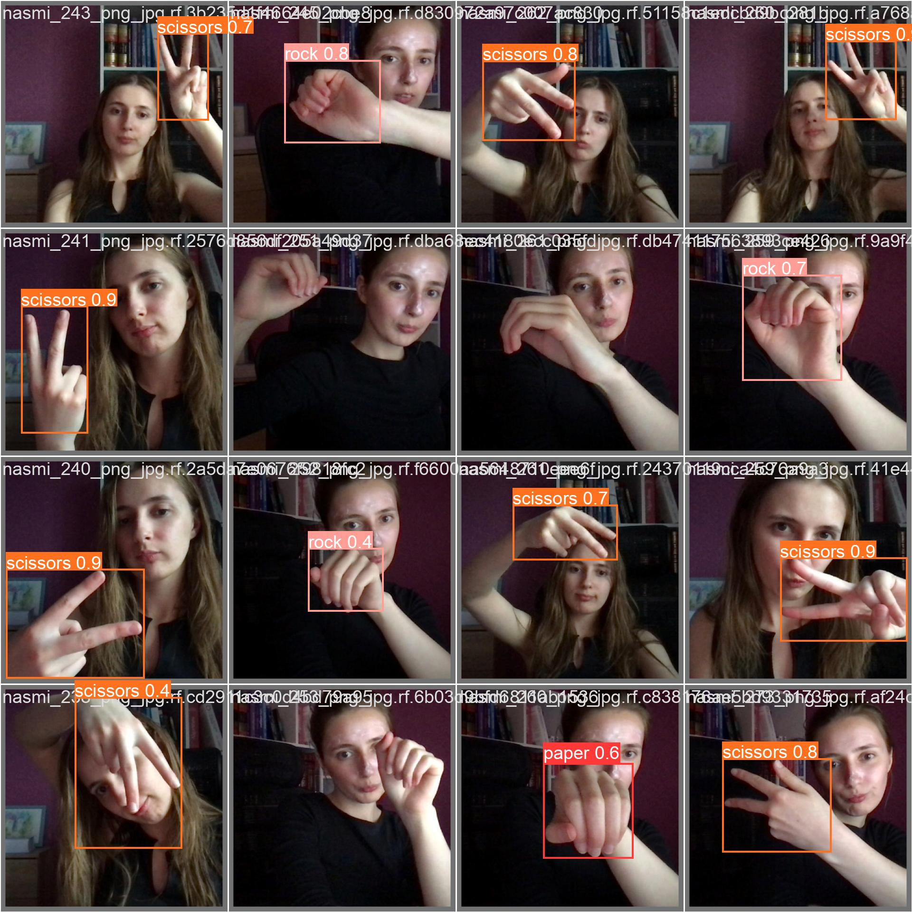
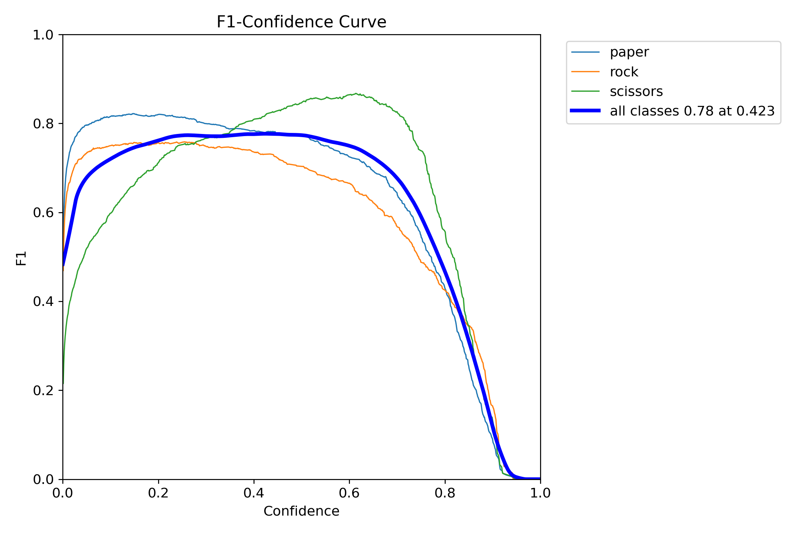

# ArtificialVision EXAMEN = RAMA "LastExam"
Funciona:


Este repositorio contiene el código necesario para ejecutar y evaluar el Examen Final de Visión Artificial. Sigue los pasos a continuación para instalar y ejecutar el modelo.

## Requisitos Previos
- [Conda](https://docs.conda.io/projects/conda/en/latest/user-guide/install/index.html) debe estar instalado en tu sistema.

## Instrucciones de Instalación

```bash
git clone https://github.com/97hackbrian/ArtificialVision.git
cd ArtificialVision
git switch LastExam

conda env create -f environment.yml
conda activate exVision
```
o 

```bash
    pip install -r requirements.txt
```

Si tienes este problema:
```bash
QObject::moveToThread: Current thread (0x1451f00) is not the object's thread (0x7d76950).
Cannot move to target thread (0x1451f00)

qt.qpa.plugin: Could not load the Qt platform plugin "xcb" in "/home/hackbrian/anaconda3/envs/exVision/lib/python3.11/site-packages/cv2/qt/plugins" even though it was found.
This application failed to start because no Qt platform plugin could be initialized. Reinstalling the application may fix this problem.

Available platform plugins are: xcb, eglfs, linuxfb, minimal, minimalegl, offscreen, vnc, wayland-egl, wayland, wayland-xcomposite-egl, wayland-xcomposite-glx, webgl.
```

Esta es la santa solución (asegurate de estar en el entorno creado):
```bash
pip install opencv-contrib-python-headless
```

## Ejecución del juego/examen

```bash
    python3 scr/mainUI.py

```

## Resultados del modelo
Para poder ver los resultados del modelo y el entramiento puede verlos en el notebook que esta en:

- [Notebook](/scr/main.ipynb)

También puede revisar los resultados en formato PDF:

- [PDF](/scr/main.pdf)



